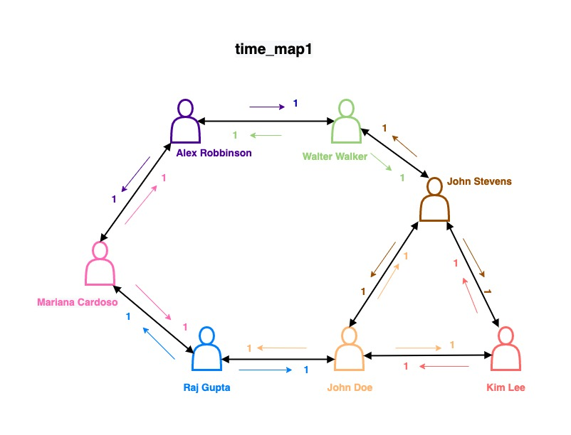
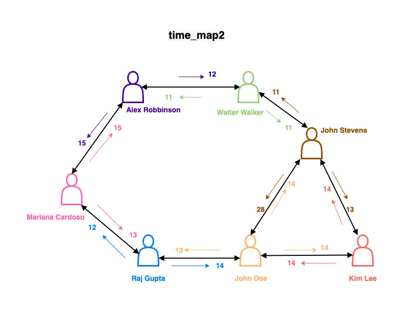
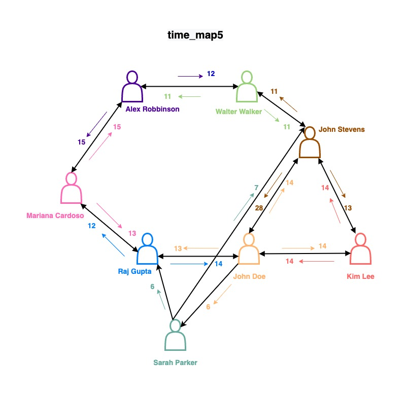
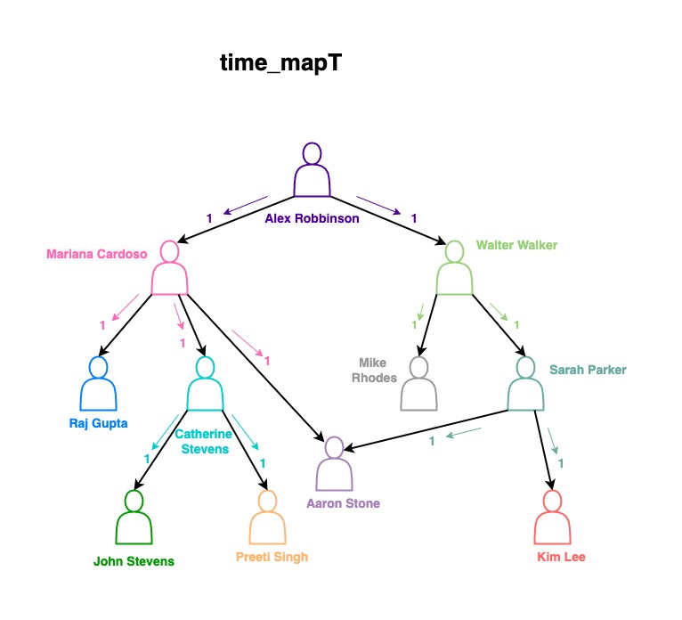
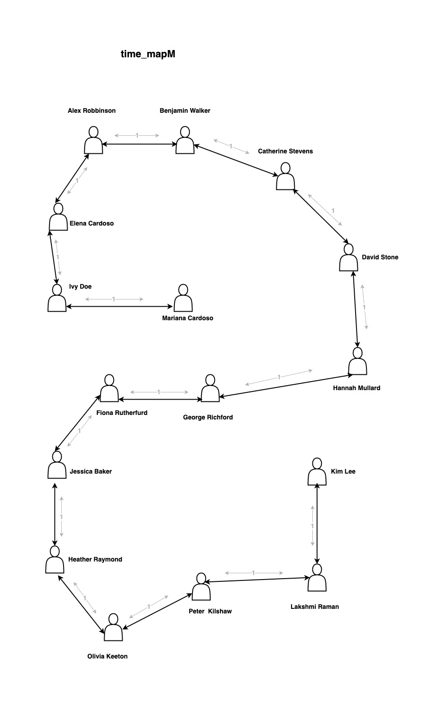

# HW 1 - Search

## Back Story

You work at a startup called FaceByte, which makes a social networking app of the same name. Willie and you, both alumni of Nerdwestern University, are part of the team responsible for social mapping. You take care of software engineering, and Willie handles the rest. 

In social networks, each user profile is treated as a node on a graph, and two nodes are said to be connected if they are each other's friends. Your team is currently testing the “find friends” and “suggested friends” features of the app before its next update release (due next week). To ensure that the features in the app yield correct results, Willie has asked you to come up with a mapping/routing system that tries to find the shortest path between two users based on certain metrics, which then feeds into the aforementioned features. So, you'll have to come up with something yourself and do it quickly. 

Fortunately, you don’t have to check all users. If the mapping works for a set of given test users, it can be deemed scalable and can be used in the app. You have relevant test case maps that encompass possible situations (loops and weightage) and thus require passing of given tests. For you, that means you only need to write three (3) more pieces of software before the launch: an implementation each of **Breadth-first Search (BFS)**, **Depth-first Search (DFS)**, and the **A\* algorithm** that are all great in tracing paths between users. You're implementing three algorithms because you want to eventually do a comparative analysis of all three.

## Task Parameters

Now, Willie understands the gravity of the task he's handed you. As such, he has supplied you with a few different maps you can use to develop the software. These maps can be found in `a_star_gradingtests.py`. The file also has tests that you can use to test your software. **Willie's only going to accept your work if your code passes all the tests.** Additionally, in order to test for robustness of your software, **Willie may also use some additional tests that he's not willing to show you now.** They will be different from the tests he's supplied you with but similar enough that if your implementation is correct, it should pass the unseen tests too as long as you don't obtain any shortcuts (e.g., hardcoding, writing code specifically aimed at passing the tests while not implementing the desired algorithm, etc.)

Willie has supplied you with two types of maps. One type specifies the distance between two user nodes in terms of *hops* (think degrees of separation); we will refer to this as the **distance map**. The other is based on user activity data from FaceByte archives on common friends, common groups, similar posts liked, message activity to common friends, similar life events, etc. between two user nodes and specifies what we'll call *similarity points*. Since it’s a metric based on the number of times two users have similarity established, we will refer to this as the **time map**. (I know, the naming is a bit awkward.) Some time maps, however, only use similarity points of 1, which is simply meant to indicate a connection between two users and is not a measure of similarity.

Now, let's understand how the maps will be used for the app features. The "find friends" feature is meant to be used by a user to find a friend by tracing a path between the user and a target friend so as to reveal the intermediate connections. This is expected to be achieved by using BFS and DFS on the time maps that simply indicate connections and not similarity. As such, the shortest path between two users is desired. The "suggested friends" feature is interesting. FaceByte wants to experiment with the feature by tracing connections between two users such that those intermediate users are as dissimilar as can be so as to diversify one's connections by suggesting friends from those intermediate users. As such, the shortest path between two  users is once again desired, as it will have the least total similarity points between the two users, which the A* algorithm is expected to yield.

For all three implementations (BFS, DFS, and A\*), you will use the similarity points between user nodes as the main metric, not hops, so the time maps are the ones to use. However, your A* function will also be given a distance map, as your A* algorithm will use the hops between user nodes as the **heuristic**. In other words, for A\*, the distance from the starting user node to the current user node will be “time-based,” but the distance from the current user node to the target user node will be “distance-based.”

Other things to note about the maps:

1. If you look at the test functions, you'll see that certain tests use certain maps. Please be mindful of that.

2. With DFS, once a node is searched and expanded, it should not be searched and expanded again. This helps to avoid repetitive work and cycles in the map. The maps for DFS don't have any loops, but the maps for BFS may contain loops.

3. When a node is expanded, the order in which its children nodes are added to the fringe will determine if the search will traverse the tree from left to right or right to left. Either direction of traversal is acceptable, i.e., the test functions will accept correct results from either direction of traversal.

4. While Willie would love for each of your algorithms to find the shortest path it could find between two users (as described earlier), he understands it may not necessarily do that. Well, for the given problems, BFS and A* will succeed in finding the shortest paths by virtue of how the algorithms work, but DFS is not guaranteed to find the shortest path, and you shouldn't worry about it (and Willie won't either). In fact, don't try to find the shortest path with DFS, as Willie's hurriedly-written tests may not pass if you do.

5. With A*, if two or more nodes have the same `f(n)`, you should use `h(n)` to break the tie, i.e., pick the node that has the smallest `h(n)`. If two or more nodes have the same `h(n)`, then pick the node that entered the open list first when returned/yielded by the `expand()` function in `expand.py`. If you're using a priority queue, then the order of the nodes will not be preserved due to sorting, so you may need to use a separate variable to keep track of the order.

For reference, some (not all) of the test case maps are shown below:









 

When passed to your A\* implementation, both the time map and the distance map are stored in the same format (a Python dictionary). Following is an example time map:

```python
Time_map = {

'John_Stevens':	{'John_Stevens':None,'John_Doe':4,'Kim_Lee':3,'Raj_Gupta':None,'Walter_Walker':1,'Alex_Robbinson':None,'Mariana_Cardoso':None},
'John_Doe':
{'John_Stevens':4,'John_Doe':None,'Kim_Lee':4,'Raj_Gupta':3,'Walter_Walker':None,'Alex_Robbinson':None,'Mariana_Cardoso':None},

'Kim_Lee':
{'John_Stevens':4,'John_Doe':4,'Kim_Lee':None,'Raj_Gupta':None,'Walter_Walker':None,'Alex_Robbinson':None,'Mariana_Cardoso':None},

'Raj_Gupta':
{'John_Stevens':None,'John_Doe':4,'Kim_Lee':None,'Raj_Gupta':None,'Walter_Walker':None,'Alex_Robbinson':None,'Mariana_Cardoso':2},

'Walter_Walker':
{'John_Stevens':1,'John_Doe':None,'Kim_Lee':None,'Raj_Gupta':None,'Walter_Walker':None,'Alex_Robbinson':1,'Mariana_Cardoso':None},

'Alex_Robbinson':
{'John_Stevens':None,'John_Doe':None,'Kim_Lee':None,'Raj_Gupta':None,'Walter_Walker':2,'Alex_Robbinson':None,'Mariana_Cardoso':5},

'Mariana_Cardoso':
{'John_Stevens':None,'John_Doe':None,'Kim_Lee':None,'Raj_Gupta':3,'Walter_Walker':None,'Alex_Robbinson':5,'Mariana_Cardoso':None}}
```

In this example, the similarity points between John Stevens and Kim Lee is `3`. `None` indicates that there is no similarity data between the two user nodes. It is also noteworthy that the similarity points established on the two sides of the same connecting path can be different. This is due to the difference in weightage of similarity points established due to more general events, likes, etc. in one direction versus personal events, likes, identity, etc. in other directions.

## Homework Deliverable

For this homework, you must implement all three (3) functions in `student_code.py`. Each function must return a path from user node `start` to user node `end`.

**The tests provided with this homework assume the use of Python 3.x. We recommend Python 3.9 or above, though if the homework works with any other version, it's all good.**

Note that:

* The result must be a list of strings. Each string contains _only_ the name of a user node. The order of the strings in the list denotes the order in which the user nodes are reached along the path;
* The result list should _begin_ with the name of the `start` user node and _terminate_ with the name of the `end` user node. (Thus, the connecting path from `A` to `A` is the list `[A]`).

For your BFS and DFS implementations must use the `expand()` function in `expand.py`, as it outputs the number of nodes expanded, which the tests check for.

Your `a_star_search` function must implement an A\* **graph** search algorithm and must also use the `expand()` function in `expand.py`. With the `expand()` function, we can verify that the correct number of nodes are expanded. As a reminder, graph search algorithms do not expand nodes that have already been visited. 

Your BFS and DFS implementations will essentially be **tree** search algorithms operating on the graphs that the maps form. Right, the maps are graphs, but for BFS and DFS, you will implement tree searches on those graphs. Now, just because they are tree searches, it doesn't mean nodes already visited can be expanded, which was discussed in #2 under Task Parameters.

Furthermore, the Autograder to be used to test your code assumes that all of the code that is needed to properly grade your assignment submission is included in `student_code.py`. Please adhere to this constraint as you develop your code. 

Additionally, you should feel invited to use Python modules for your data structures, but you need to implement BFS, DFS, and A\* yourself. You must not use functions or packages that implement them.
